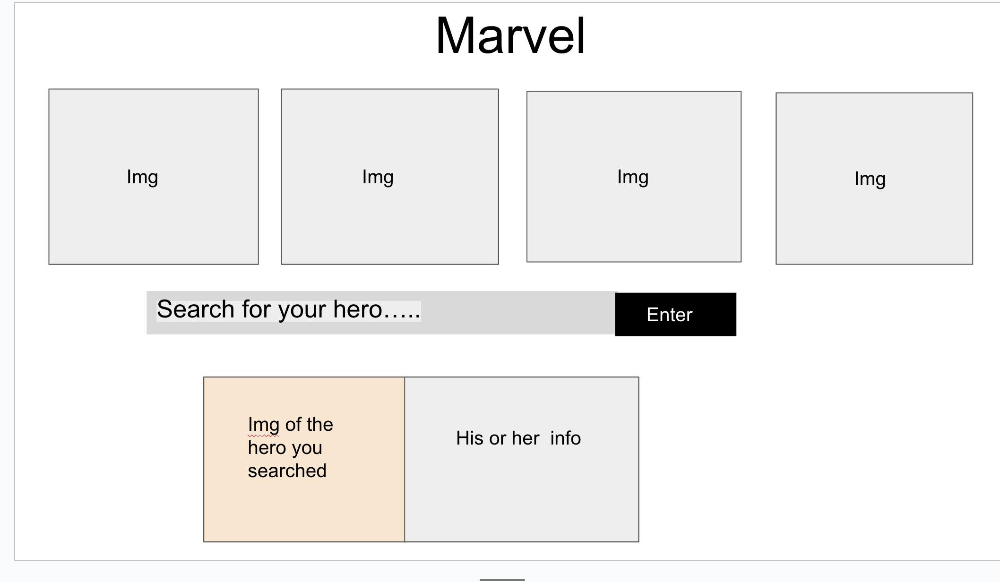

# Marvel
by Isaac Santacruz 

## technologies used
1. Html 
2. CSS
3. Javascript
4. Jquery
5. Google fonts
6. Ajax
7. Marvel API

| Todo-list | Description |
| ----------- | ----------- |
| First day | Linked files |
| Second day | Use Jquery to add content to the page |
| Third day | Create a button that we will use to search Date into the API |
| Four day | Connect the API selected and make sure it has a good status |
| Fith day | Pull data from the API into our website  |
| sixth day | Give style to the Page  |
| Last step | Make sure everything is working is spend the rest of the time improving the project  |

## Getting started 

[Click here](https://github.com/isaacxdd/Unit1-Project) to see my project, enjoy

